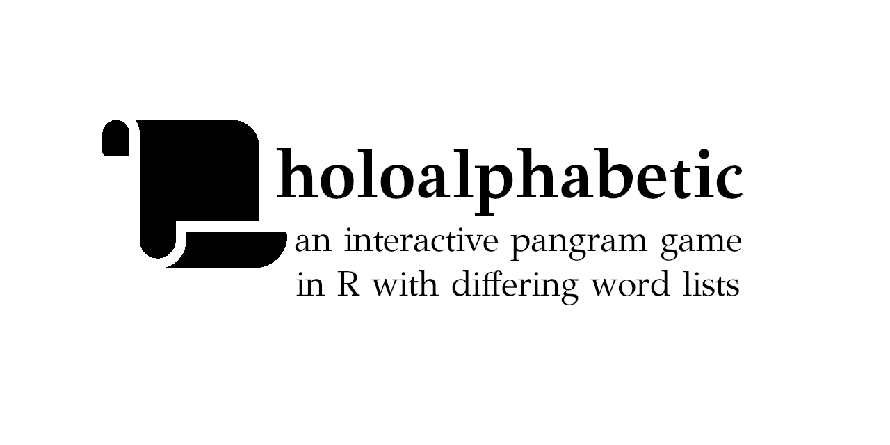

# holoalphabetic: Interactive pangram word games



This is a series of R functions written to create "pangram" wordgames. A pangram or holoalphabetic sentence is one which uses every letter of the alphabet, e.g., "Sphinx of black quartz, judge my vow." (Or, more famously, "The quick brown fox jumps over the lazy dog.") In the context of this game, however, the word game is limited to 6-10 letters (defaulting to 7). For example, the letters l, a, h, t, o, m, and b can form 46 words of at least four letters, of which the only pangram (using all seven letters) is "mothball".

The game requires you to use **one letter** in every word - for example, *m* might be required, meaning that "moth" would be an acceptable word, but "loath" would not be.

The R functions have been written to create an interactive game, meaning that you can guess words and receive points for each word.

The game is inspired by the New York Times' "[Spelling Bee](https://www.nytimes.com/puzzles/spelling-bee)," and uses word lists from the [Spell Checking Oriented Word Lists](http://wordlist.aspell.net/scowl-readme) (SCOWL) by Kevin Atkinson. Because of the multiple lists, this game adds the following functionality (besides the fact that you can play as many games as you like!):

* You can choose the number of letters in the game, from 6&ndash;10 (`num_letters`)
* You can use a more restrictive dictionary (`dictionary = "slim"`) or a broader, more inclusive one (`dictionary = "broad"`)
* You can include profanity (`obscenities = TRUE`)
* You can choose to specify the minimum number of letters for words (e.g., allow three-letter words) with `min_word_length`
* You can choose to play your own version (e.g., provide your own seven letters) with `game_letters`

## Installation

In R, you can install directly from github:

``` r
# if needed: install.packages("devtools")
devtools::install_github("jdbest/holoalphabetic")
```

## Playing the game

The most direct way to play the game is just running the function `play_game()`:

``` r
library(holoalphabetic)
play_game()
```

However, if you think you may want to play the game a bit at a time, you may assign the game's data to a variable, and then reuse it:

``` r
game1 <- play_game()
game1 <- play_game(game1)
```

You may always exit the game by typing an `x` in the Console; doing so will save your data. Note that using the ESC key will **not** result in your data saving. 

### Changing the defaults

You can also play the game with modifications; for example, you might want to play a smaller (6-letter) variant with profanity included:

``` r
game2 <- play_game(num_letters = 6, obscenities = TRUE)
```

    If you'd like to see the rules, enter 'y' and then hit return.
    Otherwise, enter your first word or leave the line blank to reorder the letters.
    Selecting letters!...Letters: F g l z n i 
    ? 

``` r
game2 <- play_game(game2)
```

## Other functions

### `create_game()`

The function `create_game()` is called by `play_game()` to make a new pangram; you may choose to create multiple games all at once, and access just the letters from the resulting object, e.g.:

``` r
letter_list <- create_game(num_letters = 8)
letter_list$game_letters
```

The `create_game()` function chooses letters at random unless you request otherwise; as a result, it occasionally will take some time until it identifies letters that can form a pangram, especially if you're using `num_letters` higher than 7.

### `find_all_words()` and `has_pangram()`

The function `find_all_words()` takes a string of letters and attempts to identify words that use any combination of them. By default, all words will use the first letter as the central one; you can change this argument. 

The function `has_pangram()` takes a vector of separated letters and simply identifies whether a pangram exists. This is particularly useful if you're doubting yourself! It intentionally does *not* tell you what the pangram is, however. (Use `find_all_words()` for that... or find it yourself!)

``` r
find_all_words("jutis")
has_pangram("jutis")
```

## Planned changes

* Upade the functions so that `play_game()` directly takes arguments for `create_game()`
* Ideally, clean up the word-choice function to happen more quickly, thus allowing for larger word sets---although this will likely always take some time. Even using regular expressions and looping only through words identified that way can still take seconds to find a game with a functioning pangram.
* Consider switching to using a package-created environment, as per *[Advanced R](https://adv-r.hadley.nz/environments.html#explicit-envs)*
* If a word list (corpus) is easily found, add a Spanish-language version
* Add a website
